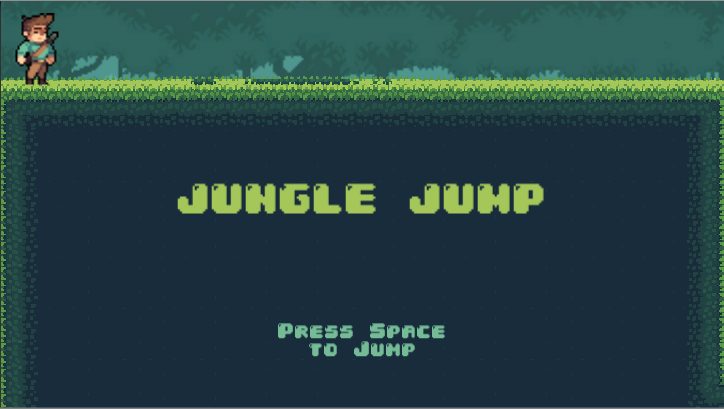

# Jungle Jump  
Adrian Kwok  
CS583

## About  
A endless running game where the player has to jump over skeletons to survive.  

## NOTE:
###### The Mac executable is somehow forced into a 16:10 aspect ratio so a windows executable that works with the inteneded 16:9 aspect ratio is included as well.  Please play with the windows version unless Mac screen has a native 16:9 aspect ratio.

## Instructions
### GOAL:  
Jump over Skeletons.  
Get highest score.  

### HOW TO PLAY:  
1. Launch Game  
2. Press Space to start game  
3. Press space to jump  

### Extra options:
To restart after death, press space.  
To exit game, click the red 'x' button at the top left of the screen.  
To check credits, click on the credits button located next to the exit button.  
